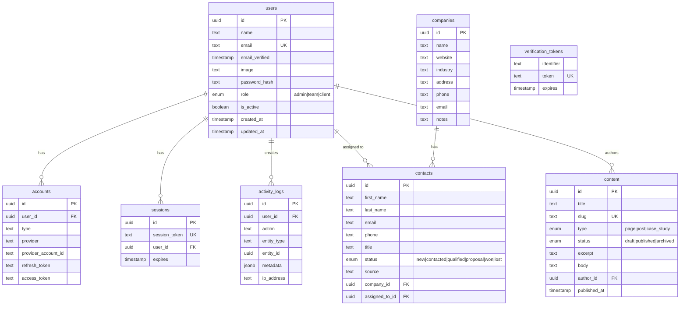

# AgencyOS — Marketing Agency Platform

> Full-service marketing agency platform. Phase 1: Foundation infrastructure.

## Quick Start

```bash
# 1. Install dependencies
pnpm install

# 2. Set up environment
cp .env.example .env.local
# Edit .env.local with your DATABASE_URL and AUTH_SECRET

# 3. Push database schema
pnpm db:push

# 4. Seed development data
pnpm db:seed

# 5. Start dev server
pnpm dev
```

Open [http://localhost:3000](http://localhost:3000)

### Default Accounts (after seed)

| Email | Password | Role |
|-------|----------|------|
| admin@agency.com | admin123 | admin |
| sarah@agency.com | team123 | team |
| john@client.com | client123 | client |

---

## Environment Variables

| Variable | Required | Description |
|----------|----------|-------------|
| `DATABASE_URL` | ✅ | PostgreSQL connection string |
| `AUTH_SECRET` | ✅ | Auth.js session secret (`openssl rand -base64 32`) |
| `AUTH_URL` | ✅ | App URL (e.g. `http://localhost:3000`) |
| `AUTH_GOOGLE_ID` | Optional | Google OAuth Client ID |
| `AUTH_GOOGLE_SECRET` | Optional | Google OAuth Client Secret |
| `NEXT_PUBLIC_APP_URL` | ✅ | Public app URL |
| `WEBHOOK_SECRET` | Optional | HMAC secret for webhook verification |
| `NEXT_PUBLIC_SENTRY_DSN` | Optional | Sentry error tracking DSN |

---

## Tech Stack

- **Framework**: Next.js 15+ (App Router, Turbopack)
- **Language**: TypeScript (strict mode)
- **Database**: PostgreSQL + Drizzle ORM
- **Auth**: Auth.js v5 (credentials, Google OAuth)
- **API**: tRPC v11 (type-safe RPC)
- **Styling**: Tailwind CSS v4 + CVA
- **Animations**: Framer Motion
- **UI**: Custom design system components

---

## Project Structure

```
marketing_agency/
├── src/
│   ├── app/                    # Next.js App Router
│   │   ├── (auth)/             # Auth pages (login, register)
│   │   ├── api/                # API routes
│   │   │   ├── auth/           # Auth.js handlers
│   │   │   ├── register/       # Registration endpoint
│   │   │   ├── trpc/           # tRPC handler
│   │   │   └── webhooks/       # Webhook receiver
│   │   ├── dashboard/          # Protected dashboard
│   │   ├── globals.css         # Design system CSS
│   │   ├── layout.tsx          # Root layout
│   │   └── page.tsx            # Landing page
│   ├── components/
│   │   ├── providers/          # Theme, tRPC providers
│   │   ├── ui/                 # Design system components
│   │   │   ├── button.tsx      # Button (CVA variants)
│   │   │   ├── input.tsx       # Input with label/error
│   │   │   ├── textarea.tsx    # Textarea
│   │   │   ├── select.tsx      # Select dropdown
│   │   │   ├── card.tsx        # Card + subcomponents
│   │   │   ├── container.tsx   # Responsive container
│   │   │   ├── grid.tsx        # Responsive grid
│   │   │   ├── modal.tsx       # Animated modal
│   │   │   ├── drawer.tsx      # Slide-in drawer
│   │   │   └── toast.tsx       # Sonner toast
│   │   └── theme-toggle.tsx    # Dark mode toggle
│   ├── db/
│   │   ├── schema/             # Drizzle ORM schemas
│   │   │   ├── users.ts        # Users, accounts, sessions
│   │   │   ├── companies.ts    # Companies
│   │   │   ├── contacts.ts     # Contacts/leads
│   │   │   ├── activity-logs.ts# Audit trail
│   │   │   ├── content.ts      # CMS content
│   │   │   └── index.ts        # Barrel export
│   │   ├── index.ts            # DB client
│   │   └── seed.ts             # Dev seed data
│   ├── lib/
│   │   ├── auth.ts             # Auth.js config
│   │   ├── trpc/               # tRPC setup
│   │   │   ├── server.ts       # Server + procedures
│   │   │   ├── client.tsx      # React client
│   │   │   ├── root.ts         # Root router
│   │   │   └── routers/        # Feature routers
│   │   └── utils.ts            # Utilities (cn)
│   ├── middleware.ts            # Route protection
│   └── types/                  # Type augmentations
├── drizzle.config.ts           # Drizzle Kit config
├── vercel.json                 # Vercel deployment
└── .github/workflows/ci.yml    # CI/CD pipeline
```

---

## Database Schema



---

## Authentication Flow

```
┌─────────────┐     ┌──────────────┐     ┌─────────────┐
│   Browser    │────▶│  Middleware   │────▶│  Auth.js    │
│  (Request)   │     │  (matcher)   │     │  (verify)   │
└─────────────┘     └──────────────┘     └─────────────┘
                           │                     │
                    ┌──────▼──────┐        ┌─────▼─────┐
                    │   Public    │        │  JWT Token │
                    │  (/, /login)│        │  + Session │
                    └─────────────┘        └─────┬─────┘
                                                 │
                                          ┌──────▼──────┐
                                          │ Role Check  │
                                          │ admin/team/ │
                                          │   client    │
                                          └─────────────┘

Protected Routes:
  /dashboard/*  → Requires authentication
  /admin/*      → Requires admin role
  /login        → Redirects to /dashboard if authenticated
  /register     → Redirects to /dashboard if authenticated

Providers:
  1. Credentials (email + password with bcrypt)
  2. Google OAuth (when configured)
  3. Magic Link (scaffold ready)
```

---

## API Route Map

### tRPC Endpoints (`/api/trpc`)

| Procedure | Type | Auth | Description |
|-----------|------|------|-------------|
| `users.me` | query | protected | Get current user |
| `users.list` | query | admin | List all users |
| `users.updateRole` | mutation | admin | Update user role |
| `contacts.list` | query | protected | List contacts |
| `contacts.getById` | query | protected | Get contact by ID |
| `contacts.create` | mutation | protected | Create contact |
| `contacts.update` | mutation | protected | Update contact |
| `contacts.delete` | mutation | protected | Delete contact |
| `companies.list` | query | protected | List companies |
| `companies.getById` | query | protected | Get company by ID |
| `companies.create` | mutation | protected | Create company |
| `companies.update` | mutation | protected | Update company |
| `companies.delete` | mutation | protected | Delete company |
| `content.listPublished` | query | public | List published content |
| `content.list` | query | protected | List all content |
| `content.getBySlug` | query | public | Get content by slug |
| `content.create` | mutation | protected | Create content |
| `content.update` | mutation | protected | Update content |
| `content.delete` | mutation | protected | Delete content |
| `activity.list` | query | admin | List activity logs |
| `activity.log` | mutation | protected | Log activity |

### REST Endpoints

| Method | Path | Auth | Description |
|--------|------|------|-------------|
| POST | `/api/register` | public | User registration |
| GET/POST | `/api/auth/*` | public | Auth.js handlers |
| POST | `/api/webhooks` | webhook-secret | Webhook receiver |

### Example: tRPC Client Usage

```typescript
// In a React component
import { trpc } from "@/lib/trpc/client";

function ContactsList() {
  const { data, isLoading } = trpc.contacts.list.useQuery({ limit: 10 });

  const createContact = trpc.contacts.create.useMutation({
    onSuccess: () => {
      // Invalidate and refetch
      utils.contacts.list.invalidate();
    },
  });

  // Create contact
  createContact.mutate({
    firstName: "Jane",
    lastName: "Doe",
    email: "jane@example.com",
    status: "new",
  });
}
```

---

## Deployment

### Vercel (Recommended)

1. Push to GitHub
2. Import project in Vercel
3. Set environment variables in Vercel dashboard
4. Deploy

### Manual

```bash
pnpm build
pnpm start
```

### Database Backup

```bash
# PostgreSQL dump
pg_dump $DATABASE_URL > backup_$(date +%Y%m%d).sql

# Restore
psql $DATABASE_URL < backup_20250213.sql
```

---

## Scripts

| Command | Description |
|---------|-------------|
| `pnpm dev` | Start dev server (Turbopack) |
| `pnpm build` | Production build |
| `pnpm start` | Start production server |
| `pnpm lint` | Run ESLint |
| `pnpm typecheck` | TypeScript type checking |
| `pnpm db:generate` | Generate migrations |
| `pnpm db:push` | Push schema to database |
| `pnpm db:migrate` | Run migrations |
| `pnpm db:seed` | Seed development data |
| `pnpm db:studio` | Open Drizzle Studio |
